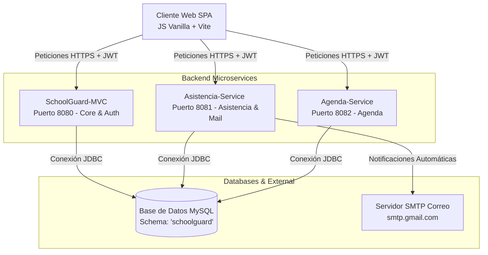

# 🛡️ SchoolGuard (ViraSchool) — Sistema de Gestión Escolar y Control de Accesos

**SchoolGuard (ViraSchool)** es un sistema distribuido y moderno diseñado para optimizar el control de accesos, el registro de asistencia en tiempo real (mediante códigos QR y formularios) y la gestión de visitas físicas, visitantes, inventario escolar y agendas académicas. 

El proyecto cuenta con una arquitectura basada en **microservicios backend (Spring Boot)** y una interfaz **Single Page Application (SPA)** de alto rendimiento y diseño premium.

---

## 🛠️ Arquitectura General

El sistema se compone de un cliente frontend SPA que se comunica directamente de forma asíncrona con tres microservicios backend utilizando peticiones HTTP seguras autenticadas con **JSON Web Tokens (JWT)**.



---

## 🚀 Características del Sistema

### 1. Control de Asistencia (Microservicio Asistencia)
* **Personal**: Registro manual de entrada/salida para personal docente y administrativo.
* **Alumnos (QR)**: Registro rápido de asistencia escaneando el código QR del alumno mediante la cámara web (utilizando la librería `html5-qrcode`).
* **Notificaciones por correo**: Al marcar asistencia de un alumno, el sistema envía automáticamente una notificación por correo electrónico (SMTP) al apoderado registrado.
* **Paginación Integrada**: Ambas pestañas de asistencia cuentan con paginación optimizada (10 registros por página) y filtros de fecha local.
* **Zona Horaria Sincronizada**: Registro con la hora local exacta del navegador, mitigando desajustes de zona horaria generados por servidores en la nube (como Render UTC).

### 2. Control de Visitantes y Padres (Microservicio Core / MVC)
* **Catálogo de Visitantes**: Registro idempotente de personas externas asociando DNI, nombre, teléfono y email.
* **Relación Familiar Real**: El sistema calcula en tiempo real cuántos hijos registrados tiene cada visitante en la institución.
* **Modal de Detalle**: Al hacer clic en un visitante o en su indicador de hijos, se despliega un panel modal interactivo con los datos del apoderado y una tabla con los nombres, grados y secciones de sus hijos asociados.

### 3. Agenda Escolar (Microservicio Agenda)
* Programación y calendarización de eventos, reuniones y horarios escolares.

### 4. Seguridad de Nivel de Producción
* Sesión persistente mediante tokens JWT (`sessionStorage`).
* Configuración estricta de políticas CSP (Content Security Policy) en el servidor para bloquear código JavaScript malicioso o inline no autorizado.

---

## 💻 Tecnologías Utilizadas

### Frontend
* **Core**: HTML5, Vanilla JavaScript (ES6 Modules).
* **Estilado**: CSS3 Personalizado (Main Design System, Dark Mode support).
* **Herramienta de construcción**: [Vite](https://vitejs.dev/)
* **Escáner QR**: `html5-qrcode`

### Backend (Microservicios)
* **Lenguaje**: Java 17
* **Framework**: Spring Boot 3.2.3 (Spring MVC, Spring Security, Spring Data JPA)
* **Base de Datos**: MySQL
* **Notificaciones**: JavaMailSender (SMTP con TLS)

---

## 📂 Estructura del Repositorio

```
SOA-Avance/
├── Proyecto/              # Microservicio principal (Auth, Alumnos, Visitantes, Visitas)
├── agenda-service/        # Microservicio de Agenda y Calendarios
├── asistencia-service/    # Microservicio de Asistencia y Notificaciones por Correo
├── frontend/              # SPA Cliente (Vite + Vanilla JS/CSS)
└── docs/                  # Manuales y documentación técnica del proyecto
```

---

## 🔧 Configuración y Ejecución Local

### Prerrequisitos
* Java JDK 17 o superior.
* Maven instalado (o utilizar los scripts `./mvnw` provistos).
* MySQL Server corriendo localmente (puerto `3306`).
* Node.js y npm instalados.

### 1. Base de Datos
Crea una base de datos vacía en tu MySQL local llamada `schoolguard`:
```sql
CREATE DATABASE schoolguard;
```
*Las tablas se autogenerarán cuando los microservicios inicien gracias a Hibernate ddl-auto configurado en `update`.*

### 2. Iniciar Microservicios Backend
En terminales independientes para cada directorio (`Proyecto`, `asistencia-service`, `agenda-service`), configura las variables y ejecuta el comando de inicio:

En Windows (PowerShell):
```powershell
# Ejemplo en carpeta Proyecto/
$env:DATABASE_URL="jdbc:mysql://localhost:3306/schoolguard"
$env:DATABASE_USER="tu_usuario"
$env:DATABASE_PASSWORD="tu_contraseña"
$env:JWT_SECRET="ClaveSecretaSuperSeguraParaFirmarLosTokensJWT12345!"
./mvnw spring-boot:run
```

*Nota: Asegúrate de configurar también las variables de correo SMTP en `asistencia-service` si deseas probar las notificaciones (`MAIL_USERNAME` y `MAIL_PASSWORD`).*

### 3. Iniciar Frontend
1. Ve al directorio `frontend`.
2. Instala las dependencias:
   ```bash
   npm install
   ```
3. Ejecuta el servidor de desarrollo local de Vite:
   ```bash
   npm run dev
   ```
4. Abre la URL en tu navegador (usualmente `http://localhost:5173`).

---

## ☁️ Despliegue en Producción (Render)

### Frontend (Static Site)
* **Build Command**: `npm run build`
* **Publish Directory**: `dist`

### Microservicios Backend (Web Service)
Configurar los Web Services en Render inyectando las siguientes variables de entorno:
* `DATABASE_URL`: URI JDBC de tu base de datos MySQL en la nube (ej: Aiven, Railway, etc.).
* `DATABASE_USER`: Nombre del usuario de BD.
* `DATABASE_PASSWORD`: Contraseña de BD.
* `JWT_SECRET`: Clave secreta idéntica en los 3 microservicios.
* `MAIL_USERNAME` / `MAIL_PASSWORD`: Credenciales de cuenta SMTP emisora (ej. Google App Password).
* `PORT`: Render asignará dinámicamente el puerto.

---

*Desarrollado y optimizado bajo principios de arquitectura orientada a servicios (SOA) y diseño web centrado en el usuario.*
