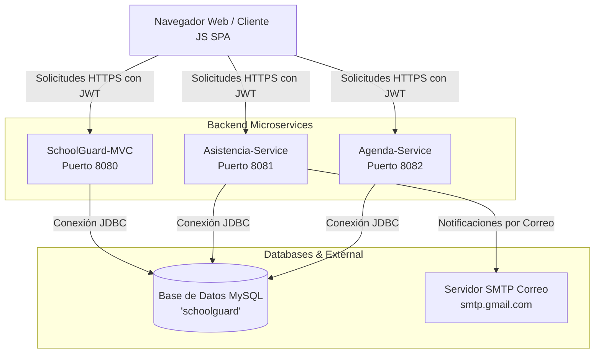

# 🛠️ Documentación Técnica del Sistema - SchoolGuard (ViraSchool)

Este documento detalla la arquitectura de software, configuración, base de datos, flujos de seguridad y despliegue del sistema **SchoolGuard (ViraSchool)**.

---

## 1. Arquitectura General del Sistema

El sistema utiliza una arquitectura distribuida basada en **Microservicios backend en Java (Spring Boot)** y un **Frontend SPA (Single Page Application)** desarrollado en JavaScript Vanilla.



---

## 2. Componentes de Software

### A. Frontend (SPA en JavaScript)
* **Tecnología**: HTML5, Vanilla CSS, Vanilla JavaScript (ES6 Modules).
* **Herramienta de Construcción**: Vite.
* **Dependencias Clave**:
  * [html5-qrcode](https://github.com/mebjas/html5-qrcode): Para el escaneo y reconocimiento de códigos QR en tiempo real a través de la cámara del cliente.
* **Enrutamiento**: Sistema de rutas personalizadas basado en hashes (`#/dashboard`, `#/visitas`, etc.) gestionado dinámicamente mediante `window.addEventListener('hashchange')`.
* **Persistencia de Sesión**: Almacenamiento local del token JWT y el rol del usuario utilizando `sessionStorage` bajo la clave `sg_session`.

### B. Backend (Microservicios Spring Boot)
El backend está dividido en tres proyectos independientes programados en **Java 17** con **Spring Boot 3.2.3**:

1. **SchoolGuard-MVC (Servicio Principal)**
   * **Responsabilidades**: Autenticación de usuarios (JWT), catálogo de visitantes, registro de visitas físicas, catálogo de alumnos, gestión del personal de inventario y logs de auditoría.
   * **URL de Producción**: `https://school-project-1mso.onrender.com`
   
2. **Asistencia-Service**
   * **Responsabilidades**: Registro de asistencia (ENTRADA/SALIDA) para personal docente/administrativo y alumnos (mediante validación de códigos QR). Integración de notificaciones automatizadas por correo electrónico en caso de incidencias.
   * **URL de Producción**: `https://school-project-assitencia-service.onrender.com`
   
3. **Agenda-Service**
   * **Responsabilidades**: Programación y calendarización de eventos, reuniones y horarios escolares.
   * **URL de Producción**: `https://school-project-agendaservice.onrender.com`

---

## 3. Modelo de Base de Datos y Persistencia

* **Motor**: MySQL Server.
* **Configuración JPA**: Se utiliza Hibernate como proveedor JPA. La propiedad `spring.jpa.hibernate.ddl-auto` está establecida en `update`, lo cual delega la creación y modificación de las tablas de la base de datos de manera automática a partir de las entidades del código Java.
* **Esquemas de Conexión**:
  Todos los microservicios se conectan a un esquema común llamado `schoolguard`. La URL de conexión JDBC se define dinámicamente con variables de entorno:
  ```properties
  spring.datasource.url=${DATABASE_URL:jdbc:mysql://localhost:3306/schoolguard}
  spring.datasource.username=${DATABASE_USER:root}
  spring.datasource.password=${DATABASE_PASSWORD:contraseña}
  ```

---

## 4. Esquema de Seguridad

### A. Autenticación y Autorización
* **Token JWT (Stateless)**: El inicio de sesión en el microservicio principal devuelve un token JWT firmado. Este token debe incluirse en la cabecera `Authorization: Bearer <TOKEN>` para todas las solicitudes subsiguientes hacia cualquier microservicio.
* **Llave Secreta Compartida**: La firma y validación de tokens entre servicios se hace compartiendo el valor de la propiedad `jwt.secret` externalizada en el sistema.

### B. Cabeceras de Seguridad (Security Headers)
Configuradas a nivel de servidor y en la inicialización de Vite (`vite.config.js`) para mitigar ataques comunes de la web:
* **Content-Security-Policy (CSP)**: Restringe la carga de scripts e imágenes a orígenes de confianza (self, Render y dominios de fuentes y estilos como Google Fonts y Cloudflare).
* **X-Frame-Options**: Establecido en `DENY` para evitar ataques de *Clickjacking* (inrustración del sitio en iframes externos).
* **X-Content-Type-Options**: Establecido en `nosniff` para evitar la lectura maliciosa de archivos bajo tipos MIME incorrectos.
* **Referrer-Policy**: Establecido en `strict-origin-when-cross-origin` para proteger información en URLs de referencia.

---

## 5. Integración de Servicios Externos

### Notificaciones de Asistencia (SMTP)
El microservicio `asistencia-service` utiliza el protocolo SMTP para enviar correos electrónicos de confirmación o alerta a los correos registrados del personal escolar o apoderados.
* **Servidor**: `smtp.gmail.com` (Puerto 587 con StartTLS).
* **Configuración del servicio**:
  ```properties
  spring.mail.host=smtp.gmail.com
  spring.mail.port=587
  spring.mail.username=${MAIL_USERNAME}
  spring.mail.password=${MAIL_PASSWORD}
  spring.mail.properties.mail.smtp.auth=true
  spring.mail.properties.mail.smtp.starttls.enable=true
  ```

---

## 6. Despliegue en Render

Para desplegar tanto el frontend como los microservicios en Render:

### Configuración del Frontend
1. Crear un servicio de tipo **Static Site** en Render.
2. **Build Command**: `npm run build`
3. **Publish Directory**: `dist`
4. Las llamadas de API en producción apuntan a las URLs reales de Render (`MVC_URL`, `AST_URL`, `AGENDA_URL`) especificadas en `src/api/client.js`.

### Configuración del Backend (Spring Boot)
1. Crear un servicio de tipo **Web Service** para cada uno de los 3 microservicios.
2. Definir las variables de entorno obligatorias en el dashboard de Render:
   * `DATABASE_URL`: URL del servidor MySQL en la nube (ej. Aiven, Railway, Render Database).
   * `DATABASE_USER`: Nombre del usuario administrador de la BD.
   * `DATABASE_PASSWORD`: Contraseña de la BD.
   * `JWT_SECRET`: Clave secreta para la encriptación de firmas del token JWT.
   * `MAIL_USERNAME` y `MAIL_PASSWORD`: Credenciales para el envío de alertas SMTP.
   * `PORT`: Render inyecta automáticamente esta variable; el servidor de Spring Boot la toma para escuchar en el puerto dinámico asignado a través de `server.port=${PORT:8080}`.
