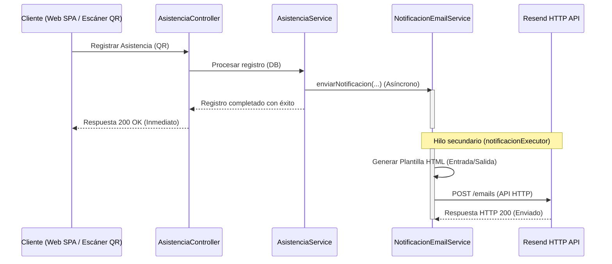

# ✉️ Funcionamiento del Servicio de Notificaciones por Correo

Este documento detalla el diseño técnico, la arquitectura y el flujo de ejecución del servicio de notificaciones por correo electrónico (**`asistencia-service`**) del sistema **SchoolGuard (ViraSchool)**.

---

## 🛠️ 1. Arquitectura y Componentes Clave

El servicio encargado de las notificaciones reside en el microservicio `asistencia-service` bajo la clase [NotificacionEmailService](file:///c:/Users/JUAN/Documents/PROYECTOS/School/School_Project/asistencia-service/src/main/java/com/ortiz/asistencia/service/NotificacionEmailService.java). Sus componentes y dependencias son:



### A. Asincronía con `@Async`
El envío de correos requiere peticiones de red hacia un servidor externo (Resend), lo que puede demorar desde cientos de milisegundos hasta segundos. Para evitar que la respuesta del registro de asistencia al usuario (portero o alumno) se retrase, el método `enviarNotificacion` está decorado con:
```java
@Async("notificacionExecutor")
```
Esto indica a Spring Boot que debe delegar la ejecución del método a un pool de hilos secundario (`notificacionExecutor`), permitiendo que el hilo principal retorne inmediatamente la respuesta exitosa a la interfaz web.

### B. Integración con Resend HTTP API
Debido a que **Render bloquea los puertos de salida SMTP tradicionales** (25, 465, 587) para prevenir spam, se utiliza el SDK oficial de **Resend Java** (`com.resend:resend-java`) que opera a través de peticiones HTTP en el puerto estándar `443` (HTTPS), evadiendo cualquier restricción de red del hosting.

---

## ⚙️ 2. Configuración del Servicio

En el archivo [application.properties](file:///c:/Users/JUAN/Documents/PROYECTOS/School/School_Project/asistencia-service/src/main/resources/application.properties) se definen los parámetros requeridos para el servicio:

```properties
# Credencial de acceso a la API
resend.api-key=${RESEND_API_KEY:re_your_api_key_here}

# Datos del remitente de los correos
notificacion.email.from=${MAIL_USERNAME:onboarding@resend.dev}
notificacion.email.nombre-remitente=SchoolGuard
```

### Inicialización (`@PostConstruct`)
Al arrancar el microservicio, el método `init()` se ejecuta de forma automática para instanciar el cliente cliente de Resend utilizando la clave de API configurada:
```java
@jakarta.annotation.PostConstruct
public void init() {
    this.resend = new Resend(resendApiKey);
}
```

---

## 🔄 3. Flujo de Ejecución Paso a Paso

Cuando se realiza una lectura de código QR exitosa de un alumno:

1. **Validación del Correo**: El servicio comprueba si el apoderado tiene una dirección de correo válida configurada en la base de datos.
   * Si la dirección es `null` o vacía, se registra una advertencia en los logs (`log.warn`) y finaliza el proceso para evitar errores de envío.
2. **Construcción del Asunto del Correo**: Se genera dinámicamente según el tipo de evento:
   * **Entrada**: `✅ [ENTRADA] {Nombre Alumno} — SchoolGuard`
   * **Salida**: `🔔 [SALIDA] {Nombre Alumno} — SchoolGuard`
3. **Generación del Cuerpo HTML**: Se construye una plantilla responsiva usando *Text Blocks* de Java (`"""..."""`) personalizada dinámicamente:
   * Si `nombreApoderado` está registrado, lo saluda de manera personalizada (*"Estimado/a Juan"*). Si no, utiliza un genérico (*"Estimado/a apoderado/a"*).
   * Adapta el color y diseño visual: Verde (`#10b981`) para **ENTRADA** y Rojo (`#ef4444`) para **SALIDA**.
   * Formatea la fecha y hora utilizando la configuración regional en español (`es-PE`).
4. **Envío del Correo**: Se arma el objeto `CreateEmailOptions` y se envía a la API:
   ```java
   CreateEmailOptions options = CreateEmailOptions.builder()
           .from(deRemitente)
           .to(emailApoderado)
           .subject(construirAsunto(tipoEvento, nombreAlumno))
           .html(construirCuerpoHtml(nombreApoderado, nombreAlumno, grado, seccion, tipoEvento, horaEvento))
           .build();

   resend.emails().send(options);
   ```
5. **Control de Fallas Silenciosas**: Todo el envío está envuelto en un bloque `try-catch`. Si ocurre un fallo crítico (como una API key inválida, límite de correos excedido o caída del servicio de Resend), el error se registra en los logs del servidor (`log.error`), pero **no interrumpe ni cancela** el registro de asistencia en el frontend. El proceso continúa con normalidad para garantizar la fluidez en el ingreso del colegio.

---

## 📧 4. Ejemplo del Cuerpo del Correo (HTML)

El correo enviado contiene un diseño limpio y moderno con las siguientes características:
* **Cabecera**: Logotipo e identificación de `SchoolGuard` sobre un degradado oscuro.
* **Badge de Evento**: Un indicador con fondo de color verde o rojo (según corresponda).
* **Ficha de Datos**: Una tarjeta con bordes redondeados estructurando la información clave:
  * **Alumno**: Nombre completo y emoji identificador.
  * **Grado / Sección**: Ubicación del estudiante.
  * **Tipo de Evento**: Confirmación de la acción (Entrada/Salida).
  * **Hora y Fecha**: Formateados con hora legible de Perú (e.g. `08:15 AM`, `15 de julio de 2026`).
* **Nota Legal**: Mensaje al final recordando que es una notificación automática desatendida.
