# 📖 Manual de Usuario - SchoolGuard (ViraSchool)

**Sistema de Gestión Escolar — Registro de Visitas, Asistencia y Control de Inventario**

> **Versión**: 1.0  
> **Fecha**: Julio 2026  
> **Dirigido a**: Personal administrativo, portería, secretaría, profesores y encargados de inventario.

---

## 📋 Índice General

1. [Acceso al Sistema (Inicio de Sesión)](#1-acceso-al-sistema-inicio-de-sesión)
2. [Panel de Control (Dashboard)](#2-panel-de-control-dashboard)
3. [Módulo de Usuarios — Crear, Editar y Eliminar Cuentas](#3-módulo-de-usuarios--crear-editar-y-eliminar-cuentas)
4. [Módulo de Visitantes — Registro de Personas Externas](#4-módulo-de-visitantes--registro-de-personas-externas)
5. [Módulo de Visitas — Control de Ingreso y Salida](#5-módulo-de-visitas--control-de-ingreso-y-salida)
6. [Módulo de Alumnos — Gestión de Estudiantes y Credenciales QR](#6-módulo-de-alumnos--gestión-de-estudiantes-y-credenciales-qr)
7. [Módulo de Asistencia — Control de Personal y Escaneo QR de Alumnos](#7-módulo-de-asistencia--control-de-personal-y-escaneo-qr-de-alumnos)
8. [Módulo de Agenda — Calendario de Eventos y Horarios de Profesores](#8-módulo-de-agenda--calendario-de-eventos-y-horarios-de-profesores)
9. [Módulo de Inventario — Control de Activos por Área](#9-módulo-de-inventario--control-de-activos-por-área)
10. [Módulo de Auditoría — Historial de Acciones del Sistema](#10-módulo-de-auditoría--historial-de-acciones-del-sistema)
11. [Roles del Sistema y Permisos](#11-roles-del-sistema-y-permisos)

---

## 1. Acceso al Sistema (Inicio de Sesión)

### Descripción
La pantalla de inicio de sesión es la puerta de entrada al sistema. Solo los usuarios registrados por un administrador pueden acceder a la plataforma.

### Proceso: Iniciar Sesión

| Paso | Acción |
|------|--------|
| 1 | Abra su navegador web e ingrese la dirección del sistema. |
| 2 | En el campo **Usuario**, escriba su nombre de usuario asignado (ej: `admin`). |
| 3 | En el campo **Contraseña**, escriba su clave de acceso. Puede presionar el ícono del **ojo** (👁) para mostrar u ocultar la contraseña. |
| 4 | Haga clic en el botón **Iniciar Sesión**. |
| 5 | Si las credenciales son correctas, será redirigido automáticamente al **Dashboard** (o al módulo de **Inventario** si su rol es Encargado de Inventario). |

> [!WARNING]
> Si las credenciales son incorrectas, aparecerá un mensaje de error en color rojo indicando **"Credenciales inválidas"**. Verifique su usuario y contraseña e intente nuevamente.

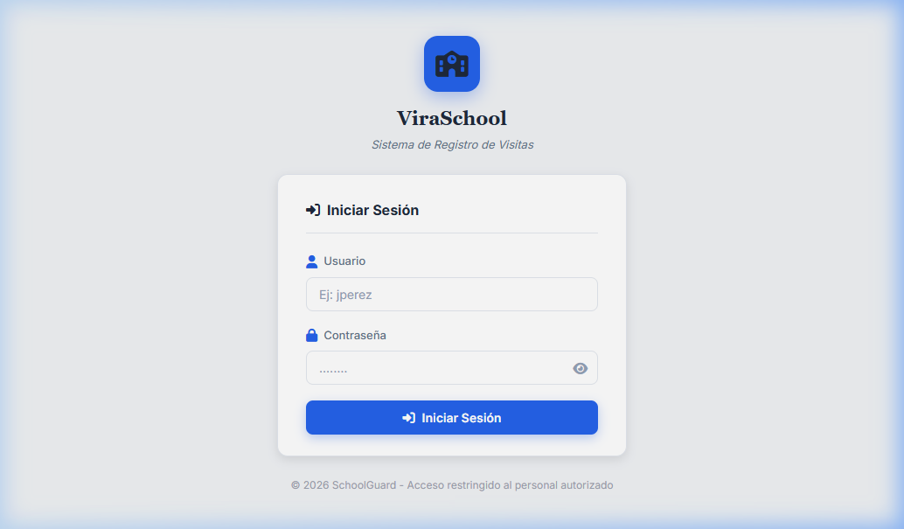

### Proceso: Cerrar Sesión

| Paso | Acción |
|------|--------|
| 1 | En cualquier pantalla del sistema, ubique la barra lateral izquierda (sidebar). |
| 2 | En la parte inferior de la barra lateral, haga clic en el botón **Cerrar Sesión** (ícono de puerta con flecha). |
| 3 | Será redirigido inmediatamente a la pantalla de inicio de sesión. |

> [!NOTE]
> La sesión se almacena temporalmente en el navegador. Si cierra la pestaña o ventana del navegador, deberá iniciar sesión nuevamente.

---

## 2. Panel de Control (Dashboard)

### Descripción
El Dashboard es la página principal del sistema. Muestra un resumen general con estadísticas y accesos rápidos a los módulos más utilizados.

### Elementos de la pantalla

| Elemento | Descripción |
|----------|-------------|
| **Tarjetas de resumen** | Muestran contadores en tiempo real: visitas activas del día, total de alumnos registrados, total de visitantes en la base de datos y alertas pendientes. |
| **Barra lateral (Sidebar)** | Menú de navegación principal con acceso a todos los módulos: Dashboard, Visitas, Visitantes, Alumnos, Asistencia, Agenda, Inventario, Usuarios y Auditoría. |
| **Perfil de usuario** | En la parte inferior de la barra lateral se muestra el nombre del usuario actual, su rol y el botón de cerrar sesión. |

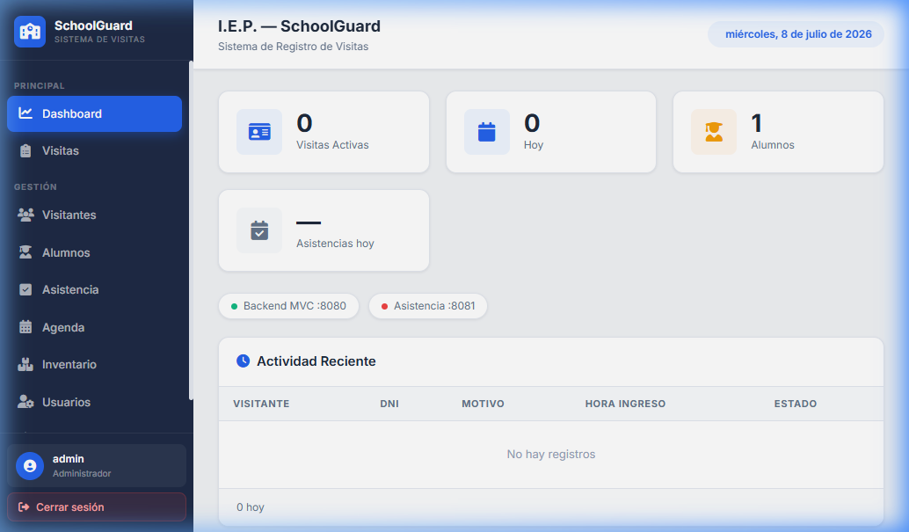

---

## 3. Módulo de Usuarios — Crear, Editar y Eliminar Cuentas

> **Acceso restringido**: Solo visible para el rol **ADMINISTRADOR**.

### Descripción
Este módulo permite gestionar las cuentas de acceso al sistema. Aquí se crean, editan y eliminan los perfiles del personal autorizado.

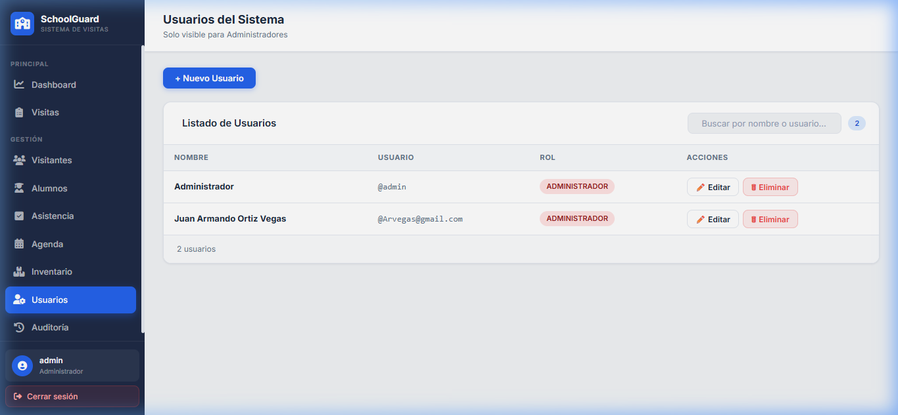

---

### Proceso: Crear un Nuevo Usuario

| Paso | Acción |
|------|--------|
| 1 | Navegue al módulo **Usuarios** desde la barra lateral izquierda. |
| 2 | Haga clic en el botón **+ Nuevo Usuario** ubicado en la parte superior. |
| 3 | Se abrirá un formulario emergente (modal) con los siguientes campos: |

**Campos del formulario:**

| Campo | Tipo | Obligatorio | Ejemplo |
|-------|------|:-----------:|---------|
| Nombre completo | Texto | ✅ | `Carlos López Mendoza` |
| Nombre de usuario | Texto | ✅ | `clopez` |
| Contraseña | Contraseña | ✅ | `portero123` |
| Rol | Lista desplegable | ✅ | `PORTERO` |

| Paso | Acción (continuación) |
|------|--------|
| 4 | Complete todos los campos obligatorios según la tabla anterior. |
| 5 | En el campo **Rol**, seleccione el rol apropiado de la lista: `ADMINISTRADOR`, `PORTERO`, `SECRETARIA`, `DIRECTOR`, `PROFESOR` o `ENCARGADO_INVENTARIO`. |
| 6 | Haga clic en el botón **Crear Usuario**. |
| 7 | Si todo es correcto, verá un mensaje de confirmación: **"Usuario creado"**. El nuevo usuario aparecerá inmediatamente en la tabla. |

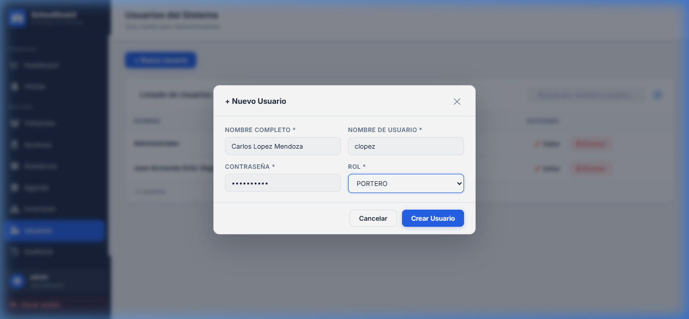

---

### Proceso: Editar un Usuario Existente

| Paso | Acción |
|------|--------|
| 1 | En la tabla de usuarios, ubique al usuario que desea modificar. |
| 2 | Haga clic en el botón **✏️ Editar** en la columna de acciones de ese usuario. |
| 3 | Se abrirá el mismo formulario, pero con los datos actuales pre-rellenados. |
| 4 | Modifique los campos que desee. El campo de **contraseña** estará vacío; si lo deja vacío, la contraseña no se cambiará. |
| 5 | Haga clic en **Actualizar**. |
| 6 | Verá el mensaje: **"Usuario actualizado"**. |

---

### Proceso: Eliminar un Usuario

| Paso | Acción |
|------|--------|
| 1 | En la tabla de usuarios, ubique al usuario que desea eliminar. |
| 2 | Haga clic en el botón **🗑 Eliminar** en la columna de acciones. |
| 3 | Aparecerá un cuadro de confirmación preguntando: **"¿Estás seguro de eliminar a [Nombre]?"** |
| 4 | Haga clic en **Eliminar** para confirmar, o en **Cancelar** para abortar la operación. |

> [!CAUTION]
> La eliminación de un usuario es **permanente** y no se puede deshacer. Asegúrese de que el usuario no necesita acceso al sistema antes de eliminarlo.

---

## 4. Módulo de Visitantes — Registro de Personas Externas

### Descripción
Permite mantener un catálogo de todas las personas externas que han visitado la institución. Al registrar a un visitante aquí, sus datos se guardan para futuras visitas, evitando volver a ingresar la información manualmente.

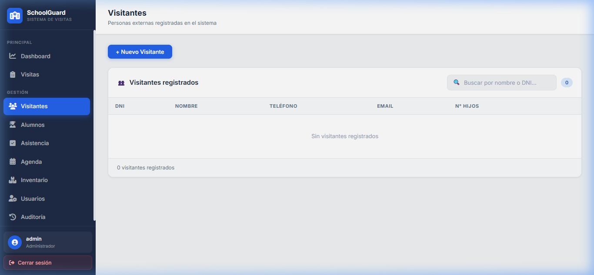

---

### Proceso: Registrar un Nuevo Visitante

| Paso | Acción |
|------|--------|
| 1 | Navegue al módulo **Visitantes** desde la barra lateral. |
| 2 | Haga clic en el botón **+ Nuevo Visitante**. |
| 3 | Se abrirá un formulario modal con los siguientes campos: |

**Campos del formulario:**

| Campo | Tipo | Obligatorio | Ejemplo |
|-------|------|:-----------:|---------|
| DNI | Texto (máx. 20 caracteres) | ✅ | `74512368` |
| Nombre completo | Texto | ✅ | `María Fernanda Quispe` |
| Teléfono | Texto | ❌ | `987654321` |
| Email | Correo electrónico | ❌ | `maria.quispe@gmail.com` |

| Paso | Acción (continuación) |
|------|--------|
| 4 | Complete al menos los campos obligatorios: **DNI** y **Nombre completo**. |
| 5 | Opcionalmente, añada el teléfono y correo electrónico del visitante. |
| 6 | Haga clic en **Registrar**. |
| 7 | Verá la confirmación: **"Visitante registrado"**. El nuevo visitante aparecerá en la tabla. |

---

### Proceso: Editar un Visitante

| Paso | Acción |
|------|--------|
| 1 | En la tabla de visitantes, ubique a la persona que desea editar. Puede utilizar la **barra de búsqueda** para filtrar por nombre o DNI. |
| 2 | Haga clic en **✏️ Editar**. |
| 3 | Modifique los datos necesarios y haga clic en **Actualizar**. |

### Proceso: Buscar un Visitante

| Paso | Acción |
|------|--------|
| 1 | En la parte superior de la tabla, ubique el campo de búsqueda con el ícono 🔍. |
| 2 | Escriba el nombre o número de DNI del visitante. |
| 3 | La tabla se filtrará automáticamente en tiempo real mostrando solo los resultados coincidentes. |

---

## 5. Módulo de Visitas — Control de Ingreso y Salida

### Descripción
Este módulo registra cada ingreso de un visitante externo a la institución educativa. Permite controlar quién entra, a qué hora, a quién visita y el motivo de la visita.

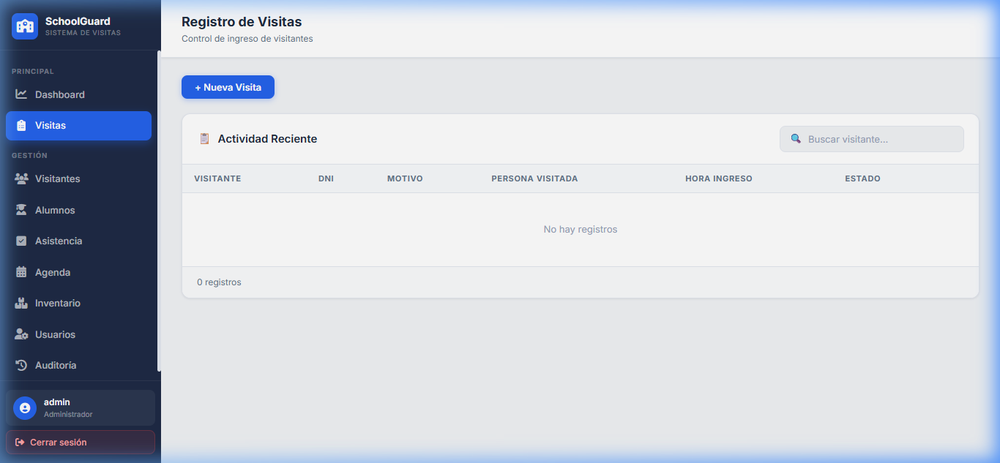

---

### Proceso: Registrar una Nueva Visita (Ingreso)

| Paso | Acción |
|------|--------|
| 1 | Navegue al módulo **Visitas** desde la barra lateral. |
| 2 | Haga clic en el botón **+ Nueva Visita**. |
| 3 | Se abrirá un formulario modal con los siguientes campos: |

**Campos del formulario:**

| Campo | Tipo | Obligatorio | Ejemplo |
|-------|------|:-----------:|---------|
| DNI Visitante | Texto + botón 🔍 | ✅ | `74512368` |
| Nombre Visitante | Texto | ✅ | `María Fernanda Quispe` |
| Motivo | Texto | ✅ | `Reunión con tutor de su hijo` |
| Persona a Visitar | Lista desplegable (usuarios) | ✅ | `Carlos López (clopez)` |
| Estado | Lista desplegable | ❌ | `REGISTRADO` (por defecto) |
| Hora Ingreso | Fecha y hora | ❌ | Se auto-completa con la hora actual |

| Paso | Acción (continuación) |
|------|--------|
| 4 | Escriba el **DNI del visitante**. Si el visitante ya fue registrado previamente, puede hacer clic en el botón **🔍** junto al campo DNI para **autocompletar** el nombre automáticamente. |
| 5 | Complete el **Motivo** de la visita. |
| 6 | Seleccione la **Persona a Visitar** del menú desplegable (lista de personal del sistema). |
| 7 | El **Estado** se asigna automáticamente como `REGISTRADO`. Puede cambiarlo a `EN_CURSO` o `COMPLETADO` según corresponda. |
| 8 | Haga clic en **Registrar**. |
| 9 | Verá la confirmación: **"Visita registrada"**. |

> [!TIP]
> Utilice el botón de búsqueda **🔍** junto al campo DNI para autocompletar los datos del visitante si ya fue registrado anteriormente. Esto evita errores de escritura y agiliza el proceso.

---

### Proceso: Cambiar el Estado de una Visita (Marcar Salida)

| Paso | Acción |
|------|--------|
| 1 | En la tabla de visitas, localice la visita activa del visitante. |
| 2 | Haga clic en **✏️ Editar**. |
| 3 | En el campo **Estado**, cámbielo de `REGISTRADO` o `EN_CURSO` a **`COMPLETADO`**. |
| 4 | Haga clic en **Actualizar**. |
| 5 | El badge de estado cambiará de azul/amarillo a **verde**, indicando que la visita ha sido finalizada. |

### Estados de una Visita

| Estado | Badge | Significado |
|--------|-------|-------------|
| `REGISTRADO` | 🔵 Azul | La visita ha sido registrada pero el visitante aún no ingresa. |
| `EN_CURSO` | 🟡 Amarillo | El visitante se encuentra dentro de la institución. |
| `COMPLETADO` | 🟢 Verde | El visitante se ha retirado y la visita ha sido finalizada. |

---

## 6. Módulo de Alumnos — Gestión de Estudiantes y Credenciales QR

### Descripción
Gestiona el padrón de estudiantes de la institución. Cada alumno registrado recibe automáticamente un **código QR único** que se utiliza para el control de asistencia mediante escaneo.

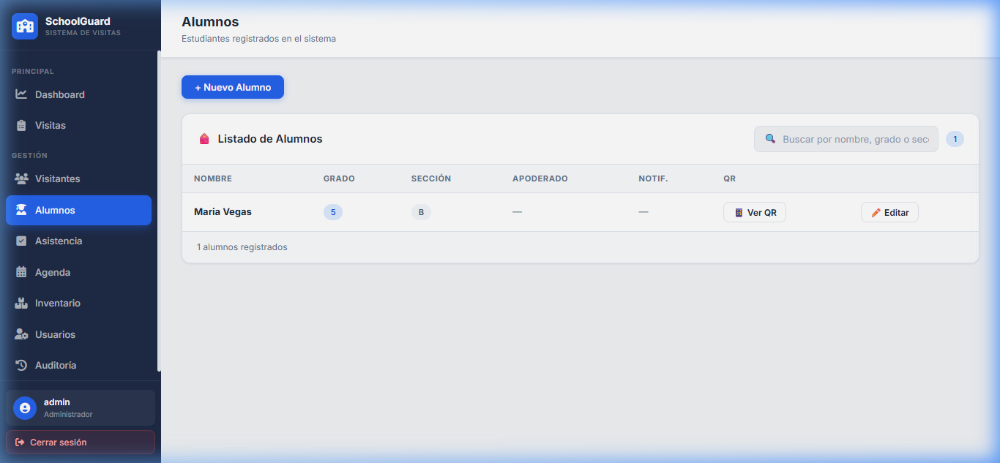

---

### Proceso: Registrar un Nuevo Alumno

| Paso | Acción |
|------|--------|
| 1 | Navegue al módulo **Alumnos** desde la barra lateral. |
| 2 | Haga clic en **+ Nuevo Alumno**. |
| 3 | Se abrirá un formulario modal: |

**Campos del formulario:**

| Campo | Tipo | Obligatorio | Ejemplo |
|-------|------|:-----------:|---------|
| Nombre completo | Texto | ✅ | `Juan Pérez Gómez` |
| Grado | Texto | ✅ | `3° Primaria` |
| Sección | Texto (máx. 5 caracteres) | ✅ | `A` |
| Apoderado (Visitante) | Lista desplegable | ❌ | `María Fernanda Quispe (74512368)` |

| Paso | Acción (continuación) |
|------|--------|
| 4 | Complete los campos **Nombre**, **Grado** y **Sección**. |
| 5 | Si desea vincular al alumno con un apoderado, selecciónelo de la lista desplegable. Esta lista muestra los visitantes registrados en el sistema. |
| 6 | Haga clic en **Registrar**. |
| 7 | Verá la confirmación: **"Alumno registrado — QR generado automáticamente"**. El sistema genera un código QR encriptado de forma automática. |

> [!IMPORTANT]
> El apoderado debe estar previamente registrado en el módulo de **Visitantes** para poder vincularlo al alumno. Si el apoderado tiene un **email registrado**, el sistema habilitará las notificaciones automáticas de asistencia por correo electrónico.

---

### Proceso: Ver y Descargar el Código QR de un Alumno

| Paso | Acción |
|------|--------|
| 1 | En la tabla de alumnos, ubique al estudiante deseado. |
| 2 | Haga clic en el botón **📱 Ver QR** en la columna "QR". |
| 3 | Se abrirá un modal mostrando la imagen del **Código QR** del alumno. |
| 4 | Haga clic en el botón **⬇ Descargar QR** para guardar la imagen en su computadora. |
| 5 | Imprima el QR y colóquelo en la credencial escolar del alumno para su uso en la entrada. |

> [!TIP]
> Es recomendable imprimir el código QR del alumno y plastificarlo para que dure todo el año escolar. El portero lo escaneará cada día en la entrada con la función de asistencia por QR.

---

## 7. Módulo de Asistencia — Control de Personal y Escaneo QR de Alumnos

### Descripción
Este módulo opera con dos pestañas independientes: una para el **Personal** (docentes, administrativos) y otra para **Alumnos** (mediante escaneo de códigos QR con la cámara del dispositivo).

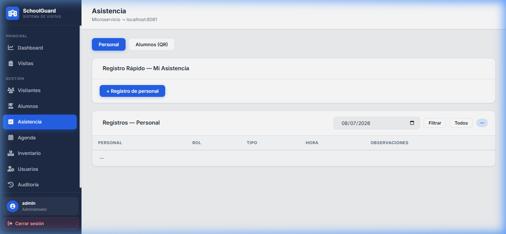

---

### Pestaña: Asistencia del Personal

#### Proceso: Registrar la Asistencia de un Empleado

| Paso | Acción |
|------|--------|
| 1 | Navegue al módulo **Asistencia** desde la barra lateral. |
| 2 | Asegúrese de estar en la pestaña **Personal** (la pestaña activa por defecto). |
| 3 | Haga clic en **+ Registro de personal**. |
| 4 | Se abrirá un formulario modal: |

**Campos del formulario:**

| Campo | Tipo | Obligatorio | Ejemplo |
|-------|------|:-----------:|---------|
| Personal | Lista desplegable | ✅ | `Carlos López Mendoza — PORTERO` |
| Tipo de Evento | Lista desplegable | ✅ | `▶ ENTRADA` o `◀ SALIDA` |
| Hora del Evento | Fecha y hora | ❌ | Se auto-completa con la hora actual |
| Observaciones | Texto | ❌ | `Llegó 10 minutos tarde` |

| Paso | Acción (continuación) |
|------|--------|
| 5 | Seleccione al **empleado** de la lista desplegable. |
| 6 | Seleccione el **Tipo de Evento**: `ENTRADA` si está llegando, `SALIDA` si se retira. |
| 7 | La hora se auto-completa con la hora actual. Modifíquela si es necesario. |
| 8 | Opcionalmente, agregue observaciones (ej: "Tardanza justificada por cita médica"). |
| 9 | Haga clic en **Registrar**. |

#### Proceso: Filtrar Registros por Fecha

| Paso | Acción |
|------|--------|
| 1 | En la sección de controles de la tabla, ubique el campo de **fecha** (muestra la fecha de hoy por defecto). |
| 2 | Seleccione la fecha deseada en el calendario. |
| 3 | Haga clic en el botón **Filtrar** para ver los registros de esa fecha. |
| 4 | Para ver todos los registros sin filtro de fecha, haga clic en **Todos**. |

---

### Pestaña: Asistencia de Alumnos por QR

#### Proceso: Registrar Asistencia Escaneando el QR del Alumno

| Paso | Acción |
|------|--------|
| 1 | Navegue al módulo **Asistencia** y haga clic en la pestaña **Alumnos (QR)**. |
| 2 | Haga clic en el botón **QR del Alumno**. |
| 3 | Se abrirá un modal con el visor de cámara del dispositivo. |
| 4 | **Enfoque el código QR** de la credencial del alumno frente a la cámara. |
| 5 | El sistema detectará automáticamente el código QR y mostrará la información del alumno (nombre, grado, sección). |
| 6 | Confirme si desea registrar una **ENTRADA** o **SALIDA**. |
| 7 | Haga clic en **Confirmar** para guardar el registro. |
| 8 | El registro aparecerá inmediatamente en la tabla de asistencia de alumnos. |

> [!NOTE]
> Si el apoderado del alumno tiene un email registrado, recibirá una **notificación automática por correo electrónico** cada vez que se registre la entrada o salida del estudiante.

---

## 8. Módulo de Agenda — Calendario de Eventos y Horarios de Profesores

### Descripción
Gestiona el calendario escolar con dos vistas principales: un **Calendario mensual** para eventos puntuales y una tabla de **Horarios Semanales** recurrentes para los profesores.

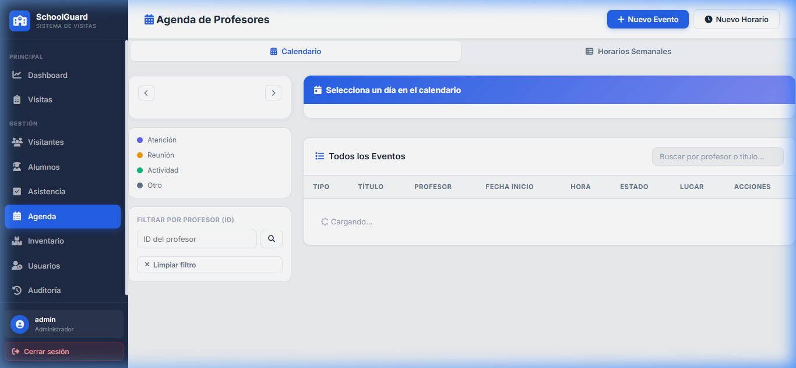

---

### Pestaña: Calendario de Eventos

#### Proceso: Crear un Nuevo Evento en el Calendario

| Paso | Acción |
|------|--------|
| 1 | Navegue al módulo **Agenda** desde la barra lateral. |
| 2 | Asegúrese de estar en la pestaña **Calendario**. |
| 3 | Haga clic en el botón **+ Nuevo Evento** en la parte superior derecha. |
| 4 | Se abrirá un formulario modal: |

**Campos del formulario:**

| Campo | Tipo | Obligatorio | Ejemplo |
|-------|------|:-----------:|---------|
| Título | Texto | ✅ | `Reunión de Padres - 3° Primaria` |
| Descripción | Texto | ❌ | `Entrega de libretas y avance del trimestre` |
| Tipo de Evento | Lista desplegable | ✅ | `REUNION`, `ACTIVIDAD`, `HORARIO_ATENCION` u `OTRO` |
| Fecha de Inicio | Fecha y hora | ✅ | `2026-07-15 08:00` |
| Fecha de Fin | Fecha y hora | ✅ | `2026-07-15 10:00` |
| Estado | Lista desplegable | ✅ | `ACTIVO` |

| Paso | Acción (continuación) |
|------|--------|
| 5 | Complete todos los campos obligatorios. |
| 6 | Seleccione el **Tipo** de evento adecuado (cada tipo se muestra con un color distinto en el calendario). |
| 7 | Haga clic en **Registrar**. |
| 8 | El evento aparecerá marcado en el calendario con un punto de color según su tipo. |

#### Tipos de Evento y Colores

| Tipo | Color | Descripción |
|------|-------|-------------|
| `HORARIO_ATENCION` | 🟣 Morado | Horario de atención a padres de familia. |
| `REUNION` | 🟡 Amarillo | Reuniones de padres, docentes o directivos. |
| `ACTIVIDAD` | 🟢 Verde | Actividades extracurriculares, deportivas o culturales. |
| `OTRO` | ⚪ Gris | Otros eventos generales. |

#### Proceso: Ver los Eventos de un Día Específico

| Paso | Acción |
|------|--------|
| 1 | En el calendario mensual, haga clic sobre el **número del día** que desea consultar. |
| 2 | En el panel lateral derecho aparecerá la lista de eventos programados para ese día. |
| 3 | Cada evento muestra su título, hora de inicio/fin, tipo y estado. |

---

### Pestaña: Horarios Semanales

#### Proceso: Crear un Nuevo Horario de Atención

| Paso | Acción |
|------|--------|
| 1 | Haga clic en la pestaña **Horarios Semanales**. |
| 2 | Haga clic en el botón **+ Nuevo Horario** (solo disponible para Administrador y Director). |
| 3 | En el formulario modal, complete: |

**Campos del formulario:**

| Campo | Tipo | Obligatorio | Ejemplo |
|-------|------|:-----------:|---------|
| Profesor | Lista desplegable | ✅ | `Prof. García Medina` |
| Día de la Semana | Lista desplegable | ✅ | `LUNES` |
| Hora de Inicio | Hora | ✅ | `08:00` |
| Hora de Fin | Hora | ✅ | `12:00` |

| Paso | Acción (continuación) |
|------|--------|
| 4 | Seleccione al profesor, el día y las horas de atención. |
| 5 | Haga clic en **Registrar**. |
| 6 | El horario aparecerá en la tabla semanal. |

---

## 9. Módulo de Inventario — Control de Activos por Área

### Descripción
Controla los bienes físicos de la institución organizados por **Áreas/Aulas** (Aula 101, Laboratorio de Cómputo, Biblioteca, etc.). Cada área contiene artículos con código de barras, cantidad y estado de conservación.

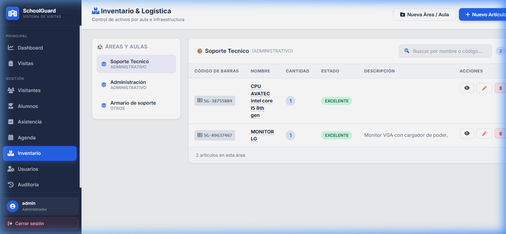

---

### Proceso: Crear una Nueva Área o Aula

| Paso | Acción |
|------|--------|
| 1 | Navegue al módulo **Inventario** desde la barra lateral. |
| 2 | Haga clic en el botón **Nueva Área / Aula** en la parte superior. |
| 3 | En el formulario modal, complete: |

**Campos del formulario:**

| Campo | Tipo | Obligatorio | Ejemplo |
|-------|------|:-----------:|---------|
| Nombre del Área | Texto | ✅ | `Aula 102` |
| Tipo | Lista desplegable | ✅ | `AULA` |

| Paso | Acción (continuación) |
|------|--------|
| 4 | Ingrese el nombre del área y seleccione el tipo. |
| 5 | Haga clic en **Crear**. |
| 6 | El área aparecerá en el panel lateral izquierdo. |

---

### Proceso: Registrar un Nuevo Artículo en el Inventario

| Paso | Acción |
|------|--------|
| 1 | En el panel izquierdo, **seleccione el área** donde se ubica el artículo (haga clic sobre ella para activarla). |
| 2 | Haga clic en el botón **Nuevo Artículo** en la parte superior. |
| 3 | En el formulario modal, complete: |

**Campos del formulario:**

| Campo | Tipo | Obligatorio | Ejemplo |
|-------|------|:-----------:|---------|
| Código de Barras | Texto | ✅ | `INV-2026-00542` |
| Nombre | Texto | ✅ | `Proyector Epson X41` |
| Cantidad | Número | ✅ | `2` |
| Estado | Lista desplegable | ✅ | `BUENO` |
| Descripción | Texto | ❌ | `Proyector de aula multimedia, control remoto incluido` |
| Área | Lista desplegable | ✅ | El área seleccionada previamente |

| Paso | Acción (continuación) |
|------|--------|
| 4 | Complete todos los campos obligatorios. |
| 5 | Seleccione el **Estado** apropiado para el artículo. |
| 6 | Haga clic en **Registrar**. |
| 7 | El artículo aparecerá en la tabla de la derecha, asociado al área seleccionada. |

### Estados del Inventario

| Estado | Badge | Significado |
|--------|-------|-------------|
| `EXCELENTE` | 🟢 Verde | El artículo se encuentra en condiciones óptimas. |
| `BUENO` | 🔵 Azul | El artículo funciona correctamente con uso normal. |
| `REGULAR` | 🟡 Amarillo | El artículo presenta desgaste pero aún es funcional. |
| `DETERIORADO` | 🔴 Rojo | El artículo requiere reparación o reemplazo urgente. |
| `EN_MANTENIMIENTO` | 🟣 Morado | El artículo está temporalmente fuera de servicio por reparación. |

---

## 10. Módulo de Auditoría — Historial de Acciones del Sistema

> **Acceso restringido**: Solo visible para el rol **ADMINISTRADOR**.

### Descripción
Registra todas las operaciones realizadas en el sistema para garantizar la trazabilidad, la transparencia y la responsabilidad de cada acción.

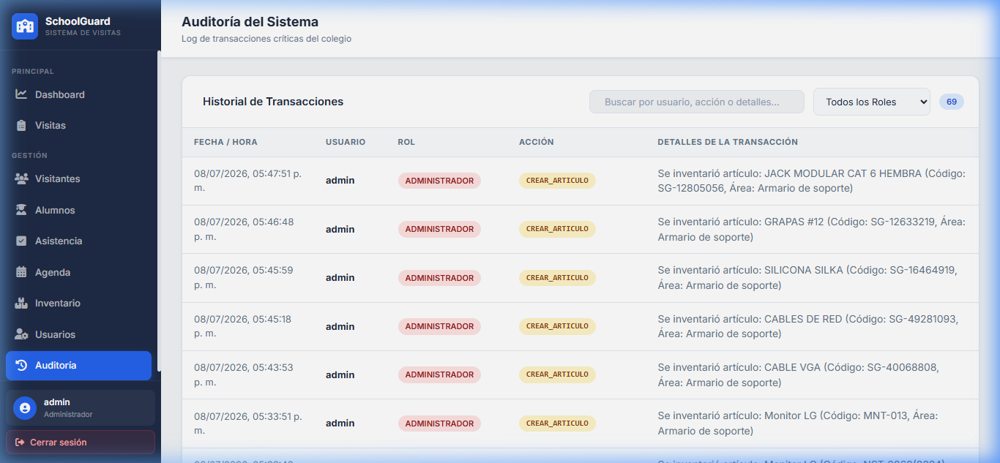

---

### Proceso: Consultar el Historial de Auditoría

| Paso | Acción |
|------|--------|
| 1 | Navegue al módulo **Auditoría** desde la barra lateral. |
| 2 | La tabla mostrará automáticamente todos los registros de acciones realizadas. |
| 3 | Cada registro incluye: **Usuario que realizó la acción**, **Tipo de operación** (crear, editar, eliminar), **Entidad afectada**, **Fecha y hora** y **Detalles de los cambios**. |
| 4 | Utilice la barra de búsqueda para filtrar por nombre de usuario o tipo de acción. |

> [!NOTE]
> El log de auditoría es **de solo lectura**. No se pueden editar ni eliminar registros de auditoría, lo que garantiza la integridad del historial.

---

## 11. Roles del Sistema y Permisos

El sistema opera con un esquema de **roles y permisos** que restringe el acceso a determinados módulos según el perfil del usuario.

| Rol | Dashboard | Visitas | Visitantes | Alumnos | Asistencia | Agenda | Inventario | Usuarios | Auditoría |
|-----|:---------:|:-------:|:----------:|:-------:|:----------:|:------:|:----------:|:--------:|:---------:|
| **ADMINISTRADOR** | ✅ | ✅ Leer/Escribir | ✅ Leer/Escribir | ✅ Leer/Escribir | ✅ Leer/Escribir | ✅ Leer/Escribir | ✅ Leer/Escribir | ✅ | ✅ |
| **SECRETARIA** | ✅ | ✅ Leer/Escribir | ✅ Leer/Escribir | ✅ Leer/Escribir | ✅ Leer/Escribir | ✅ Solo lectura | ✅ Leer/Escribir | ❌ | ❌ |
| **PORTERO** | ✅ | ✅ Leer/Escribir | ✅ Solo lectura | ✅ Solo lectura | ✅ Leer/Escribir | ✅ Solo lectura | ❌ | ❌ | ❌ |
| **DIRECTOR** | ✅ | ✅ Solo lectura | ✅ Solo lectura | ✅ Solo lectura | ✅ Solo lectura | ✅ Leer/Escribir | ✅ Leer/Escribir | ❌ | ❌ |
| **PROFESOR** | ✅ | ✅ Solo lectura | ✅ Solo lectura | ✅ Solo lectura | ✅ Solo lectura | ✅ Leer/Escribir | ❌ | ❌ | ❌ |
| **ENCARGADO_INVENTARIO** | ❌ | ❌ | ❌ | ❌ | ❌ | ❌ | ✅ Leer/Escribir | ❌ | ❌ |

> [!IMPORTANT]
> El rol de **ENCARGADO_INVENTARIO** tiene acceso exclusivamente al módulo de Inventario. Al iniciar sesión, será redirigido automáticamente a ese módulo en lugar del Dashboard.

---

*© 2026 SchoolGuard (ViraSchool) — Sistema de Gestión Escolar. Acceso restringido al personal autorizado.*
